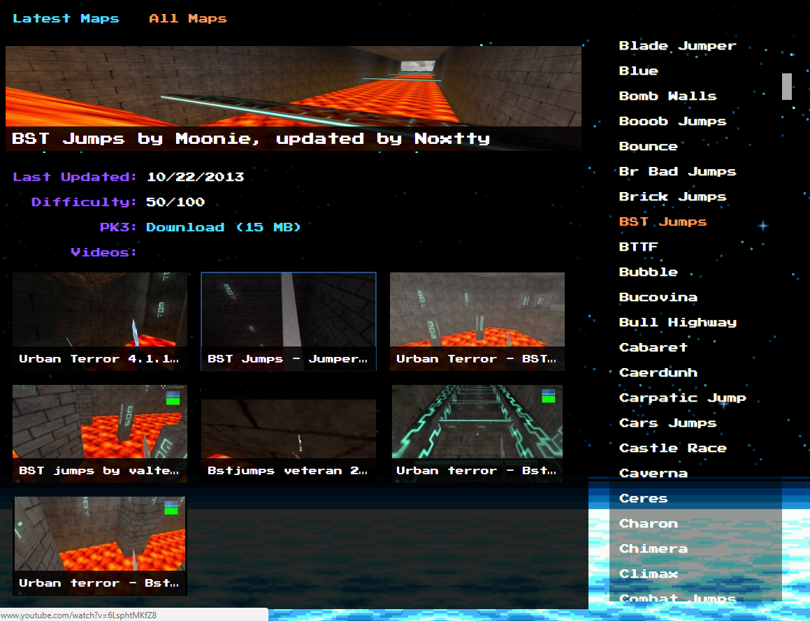

# Urban Terror Jump Maps Viewer
I made this AngularJS web app as an alternate way of interacting with the available jump maps and their metadata from [UrtJumpers](http://www.urtjumpers.com/). This app also automatically searches for and obtains YouTube videos of a given map.

* [Link](https://ephemerant.github.io/urt-maps-viewer/)

## Latest Maps

## All Maps

